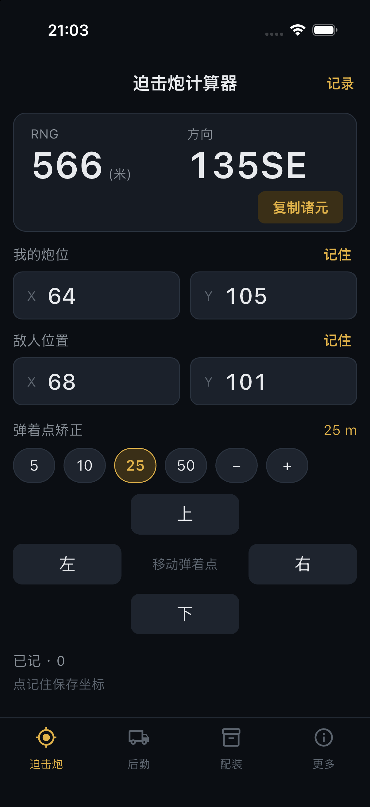
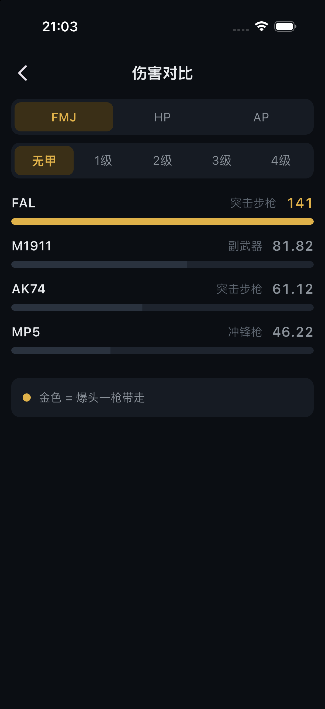
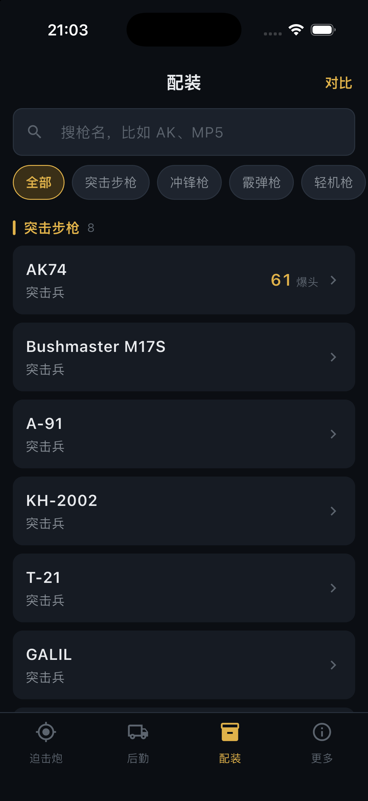
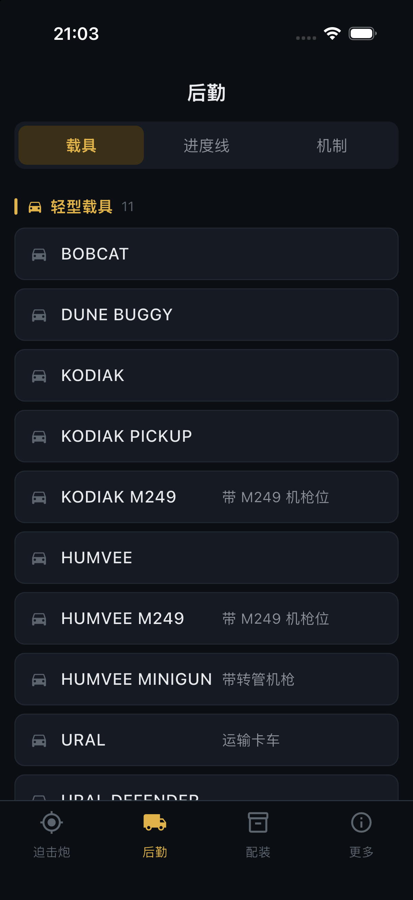

<div align="center">

# 战狗小助手

**WARDOGS 迫击炮诸元计算器 · 完全离线**

报个坐标就出诸元，不用心算，不用切出游戏。

[](https://github.com/wuha-like-sleep/WarDogs-Support/releases/latest)
[](#完全离线)
[](LICENSE)

</div>

---

## 它解决什么问题

迫击炮打的是你看不见的目标。队友在频道里喊一串坐标，你得心算距离和方位，
手忙脚乱算错一位，一发炮弹就白扔了。

这个 App 就干一件事：**把坐标变成能直接用的诸元。**

<div align="center">

</div>

填进你的炮位和敌人坐标，距离和方向立刻出来。打偏了不用重新问坐标 ——
按「上下左右」挪弹着点，诸元自动重算。

炮位一局之内不会动，所以 App 会替你记住，下次打开光标直接落在敌人坐标上。

---

## 主要功能

### 迫击炮诸元
- 坐标进、距离方位出，一格地图 = 100 米
- 弹着点矫正：步长 5 / 10 / 25 / 50 米可调
- 射击记录：复制诸元时自动记一发，随时一键还原整套坐标
- 自带大按键小键盘，不用等系统键盘弹出来

### 伤害对比
选弹药和护甲等级，直接排出哪把枪打得动。金色代表爆头一枪带走。

### 资料库
枪械、载具、六条进度线、核心机制，全部离线可查。

<div align="center">



</div>

---

## 完全离线

**这个 App 不联网。** 所有计算、资料和你记下的坐标都在手机本地，没有服务器，
不上传任何东西。飞行模式下功能完全一样。

唯一一次网络请求，是你主动点「检查更新」去看有没有新版本。除此之外它不会自己
发起任何请求 —— 安卓包里**只申请 `INTERNET` 一个系统权限**，就是给这个用的。

这条线由 [`tool/check-offline.sh`](tool/check-offline.sh) 守着，每次改动都会检查。

---

## 下载

去 [Releases](https://github.com/wuha-like-sleep/WarDogs-Support/releases/latest) 下载最新的
APK 安装即可。安装时系统可能提示「未知来源」，允许一次就行。

iOS 版本请关注后续发布。

---

## 免责声明

本工具由玩家自发制作，**免费提供，不用于任何商业用途，也不用于宣传推广**。

与 BULKHEAD、Team17 无关，未获其授权或认可。WARDOGS 及相关名称、商标、美术资源
均归其权利人所有。本工具不包含、不分发任何游戏文件或官方美术资源。

数据整理自公开社区攻略，仅供参考，**以游戏内实际数值为准**。游戏仍在抢先体验阶段，
数值会随版本调整。

如权利人认为本工具有不妥之处，请联系删除。

---

## 开源与署名

本项目以 [MIT 许可证](LICENSE)开源。欢迎任何人拿去用、改、二次开发 ——
这本来就是给玩家做的东西，多几个人做只会更好。

唯一的要求是 MIT 写明的那条：**保留原始版权声明**。如果你的项目借鉴或复用了这里的
代码，请标明出处：

```
https://github.com/wuha-like-sleep/WarDogs-Support
```

尤其是诸元计算逻辑（[`lib/ballistics.dart`](lib/ballistics.dart)）—— 那套公式是从
实机数据一点点反推并验证出来的，不是照抄来的。用它的话，麻烦提一句来源。

---

<details>
<summary><b>开发者信息</b></summary>

### 技术栈

Flutter，安卓 + iOS。无后端、无数据库、无第三方服务。

### 诸元公式

公式从实机数据反推并验证，别凭感觉改：

- 一格地图 = **100 米**
- 距离 = `√(dx² + dy²) × 100`
- 方位角 = `atan2(东向分量, 北向分量)`，正北 0°，顺时针递增
- 坐标系：**X 向东为正，Y 向北为正**

校验样例（已写死在 `test/ballistics_test.dart`）：

| 炮位 | 敌人 | 应得 |
|---|---|---|
| 63.41, 104.52 | 67.56, 100.67 | 566 米 / 133SE |

### 本地检查

```bash
flutter test              # 104 个测试：弹道、界面链路、5 种屏幕 × 3 种字号的渲染
flutter analyze           # 静态分析
./tool/check-offline.sh   # 不联网门禁
```

`check-offline.sh` 检查三件事：正式包权限只有 INTERNET、网络调用只出现在
`updater.dart`、`checkForUpdate` 只被「更多」页调用（不会开机自动联网）。

### 发版

版本号要在两处保持一致：`pubspec.yaml` 的 `version` 和
`lib/data/updater.dart` 的 `kAppVersion`。Release 的 tag 名就是版本号。

```bash
flutter build apk --release
```

正式签名走 `android/key.properties`（已在 .gitignore 里，不进仓库）。
该文件缺失时自动回落到 debug 签名，所以别人 clone 下来也能直接构建。

iOS 归档**不要**加 `--no-codesign`，否则 Distribute 时会报 No Team Found in Archive。

### 补数据

`lib/data/game_data.dart` 是唯一数据源。拿不到的字段留 `null`，
界面会显示横杠而不是把整行藏掉。

### 改动时的硬约束

1. **不放官方美术资源** —— 图标、界面里都不许用游戏截图、logo、立绘
2. **不碰游戏进程** —— 不做破解、外挂、注入、读内存
3. **不收费、不放广告、不做内购**
4. **不加权限** —— 除 INTERNET 外加任何权限，门禁都会红
5. **界面文案写给玩家看** —— 不要出现开发进度、接口名、状态码

</details>

<div align="center">
<sub>MIT License · © 2026 wuha-like-sleep</sub>
</div>
